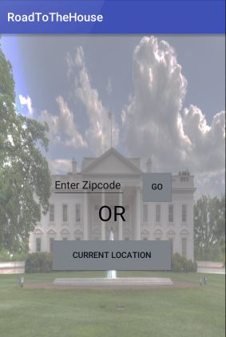

# PROG 02: Represent!

This is the RoadToTheHouse app that gives voters facts on the go. You get to input your zipcode or just click on current location and you will get a list of 3 congressional representatives for that location. By clicking on each representetative you get to know their party, as well as more information (if desired). At the same time you will get to follow the current representative that you are viewing on your watch.

NOTE: My project is under the CATNIP folder.

## Authors

Antonio Contreras ([tones24@berkeley.edu](mailto:tones24@berkeley.edu))

## Demo Video

See [Proj2b] (https://vimeo.com/157687990)
See [Proj2c] (https://vimeo.com/158705112)

## Screenshots

## Acknowledgments

Shout out to the creators of the Catnip skeleton: Jasper O'leary, Jingyi Li and all 
of the people who answer questions on StackOverFlow.
